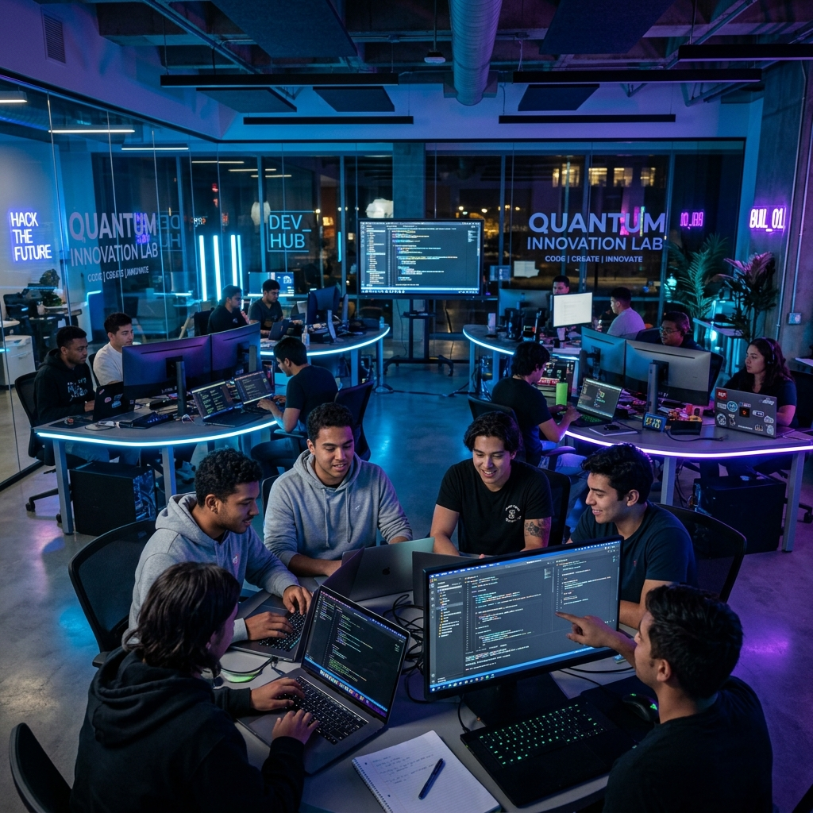

# ✦ Nexus Clubs | Discover Your Passion

Welcome to the official repository for **Nexus Clubs**, a premium, high-performance college clubs portal designed to empower students through innovation, leadership, and community impact.



## 🚀 Overview

Nexus Clubs is a state-of-the-art web application that serves as a central hub for student organizations. It features a sleek, modern UI inspired by premium design systems, offering a seamless experience for discovering clubs, tracking upcoming events, and joining vibrant student communities.

## ✨ Key Features

- **Dynamic Design**: A premium dark-themed interface with glassmorphism, smooth gradients, and vibrant accent colors.
- **Interactive Club Directory**: Search and filter through elite clubs including *NextGen MergMind*, *Student Ambassador*, and *Impact Nexus*.
- **Event Management**: Real-time countdown for major events and an organized schedule for upcoming summits and hackathons.
- **Multi-Step Application**: A streamlined, user-friendly join form with real-time validation and progress tracking.
- **Visual Excellence**:
  - Custom interactive cursor and scroll progress indicator.
  - Responsive gallery showcasing club activities.
  - Smooth scroll animations and reveal-on-scroll effects.
- **Dark/Light Mode**: User-toggleable theme preferences with persistent state.
- **SEO Optimized**: Fully semantic HTML5 structure with descriptive meta tags.

## 🛠️ Technology Stack

- **Core**: HTML5, Vanilla JavaScript (ES6+)
- **Styling**: Modern CSS3 (Custom properties, Flexbox, Grid, Glassmorphism)
- **Typography**: Google Fonts (Inter)
- **Icons/Visuals**: Custom SVG icons and curated imagery.

## 📁 Project Structure

```text
/Nexus-Clubs
├── index.html       # Main application entry point
├── style.css        # Core design system and layout styling
├── script.js        # Interactive logic and state management
├── coding.png       # Gallery/Hero assets
├── impact.png
├── leadership.png
└── networking.png
```

## 🏁 Getting Started

### Prerequisites

To view the project locally, you only need a modern web browser (Chrome, Firefox, Edge, or Safari).

### Installation

1. Clone the repository:

   ```bash
   git clone https://github.com/your-username/nexus-clubs.git
   ```

2. Navigate to the project directory:

   ```bash
   cd nexus-clubs
   ```

3. Open `index.html` in your browser:

   - On Windows: `start index.html`
   - On Mac: `open index.html`
   - Or use the **Live Server** extension in VS Code for the best experience.

## 📸 Preview

The website includes dedicated sections for:

- **Hero**: Catchy introduction with background blobs.
- **Stats**: Live counters for members and elite clubs.
- **FAQ**: Comprehensive answers for prospective members.
- **Stories**: Testimonials from active club members.
- **Team**: Introduction to the student leaders driving the community.

## 📄 License

This project is licensed under the MIT License.

---

Designed with precision for excellence by **Nexus Clubs Organization**.
